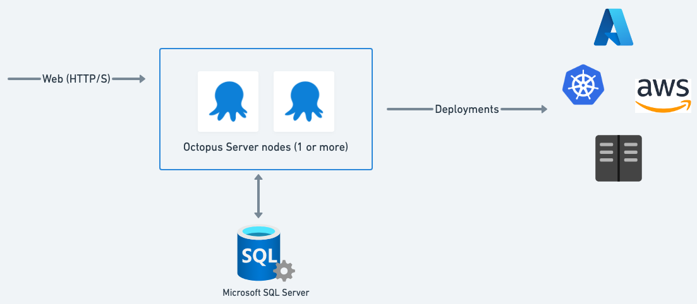

# Octopus Deploy Helm Chart

This chart installs [Octopus Deploy](https://octopus.com) into a Kubernetes cluster using the [Helm](https://helm.sh) package manager.

The published charts can be found in the [GitHub Container Registry repository](https://github.com/OctopusDeploy/helm-charts/pkgs/container/octopusdeploy-helm).


## Quick Start
This section shows you how to get Octopus running as quickly as possible on your own Kubernetes infrastructure. 

If you are creating a long-lived, production Octopus instance we recommend you read the [Configuration](#configuration) section below.

Once you have your [license key](#license-key), you can run the command below to install Octopus Deploy:

```bash
helm upgrade octopus-deploy \
--install \
--namespace octopus-deploy \
--create-namespace \
--set octopus.acceptEula="Y" \
--set octopus.licenseKeyBase64="<Your License Key>" \
--set mssql.enabled="true" \
oci://ghcr.io/octopusdeploy/octopusdeploy-helm
```

### License Key
You will need a license key to install Octopus. You can [start a trial](https://octopus.com/start) (choose `Server` to run Octopus on your own infrastructure), or retrieve your existing license key from the [Control Center](https://octopus.com/control-center/). 

You will need the Base64 encoded version of the license key.


## Configuration

The Quick Start section above is optimized for simplicity.  Below we explain the optional configuration. 



### SQL Server
Octopus Deploy requires a Microsoft SQL Server database.

The Quick Start installs SQL Server as a sub-chart. 

If you want to host SQL Server independently, you must supply the connection string: 

```yaml
octopus:
  databaseConnectionString: <Your connection string>
```

The database connection string should look something like:

```
Server=tcp:octopus-deploy.database.windows.net,1433;Initial Catalog=OctopusDeploy;Persist Security Info=False;User ID=octopus-deploy;Password={your_password};Encrypt=True;Connection Timeout=30;
```

See the Microsoft documentation for more [SQL Server installation options](https://learn.microsoft.com/en-us/sql/linux/sql-server-linux-setup).


### Master Key

[Octopus uses a master key to encrypt sensitive values](https://octopus.com/docs/security/data-encryption). 

**It is important you store the master key!**  
If you ever need to create a new Octopus instance and wish to use keep all your existing data, then the master key is required.  

By default, the master key is generated, stored in Kubernetes secret, and output when the Helm chart is installed.  If you need to supply an existing master key this can be done as follows 

```yaml
octopus:
  masterKey: <Your master key>
```

### Persistent Volumes

This chart requires persistent volumes to store:

- [Packages](https://octopus.com/docs/packaging-applications/package-repositories/built-in-repository) 
- [Artifacts](https://octopus.com/docs/projects/deployment-process/artifacts)
- [Task Logs](https://octopus.com/docs/support/get-the-raw-output-from-a-task)

These volumes are shared across Octopus nodes. 

By default, your Kubernetes cluster's [default storage class](https://kubernetes.io/docs/tasks/administer-cluster/change-default-storage-class/) will be used.

This default can be overridden in two ways.

You can configure the storage class to be used for all three of the persistent volumes above (and for the SQL Server sub-chart if enabled) via:

```yaml
global:
  storageClass: "<your storage class name>"
```

This storage class must support ReadWriteMany access modes when the chart is configured to create more than one Octopus node (`replicaCount` > 0). 
ReadWriteOnce or ReadWriteMany can be used for single node clusters.

Alternatively, each volume may be configured individually. An example is shown below.

```yaml
octopus:
  packageRepositoryVolume:
    size: 20Gi 
    storageClassName: "azure-file"
    storageAccessMode: ReadWriteMany
  artifactVolume:
    size: 1Gi 
    storageClassName: "azure-file"
    storageAccessMode: ReadWriteMany
  taskLogVolume: 
    size: 1Gi 
    storageClassName: "azure-file"
    storageAccessMode: ReadWriteMany
```

#### Cluster shared storage

Octopus can store the files that every node needs to share in a cluster shared directory. This is required for [multi-node support for polling tentacles](#multi-node-polling-tentacles), and requires a version of Octopus Server whose container supports the `CLUSTER_SHARED_CONFIG` environment variable.

This is configured with `octopus.clusterShared.mode`:

| Mode | Volumes |
| --- | --- |
| `""` (default) | The package repository, artifact, task log and audit log volumes. `CLUSTER_SHARED_CONFIG` isn't set. |
| `SEPARATE_VOLUMES` | The same volumes as the default. Clears any cluster shared directory configured previously. |
| `SEPARATE_VOLUMES_WITH_CLUSTER_SHARED` | The same volumes as the default, plus a cluster shared volume mounted at `/clusterShared`. Octopus stores transient execution data (the package cache, DataBus and DataStreams) there. |
| `CLUSTER_SHARED` | A single cluster shared volume mounted at `/clusterShared`, which holds packages, artifacts, task logs, event exports and transient execution data. The other volumes aren't created. |

```yaml
octopus:
  clusterShared:
    mode: SEPARATE_VOLUMES_WITH_CLUSTER_SHARED
    volume:
      size: 10Gi
      storageClassName: "azure-file"
```

The cluster shared volume follows the same rules as the other shared volumes. It uses `global.storageClass` if no storage class is set, and is ReadWriteMany when `replicaCount` is greater than 1.

To store transient execution data on different storage, such as faster storage that isn't backed up, enable a separate executions volume, mounted at `/executionsClusterShared`:

```yaml
octopus:
  clusterShared:
    mode: SEPARATE_VOLUMES_WITH_CLUSTER_SHARED
    executionsVolume:
      enabled: true
      size: 10Gi
      storageClassName: "fast-rwx"
```

#### Git resources
Octopus supports interacting with git resources for various purposes, such as [Config As Code](https://octopus.com/docs/projects/version-control) or as a source for deployment dependencies. When this occurs, Octopus must clone the repository to the local filesystem. 

Due to the nature of git, it is important that these files _not_ be shared across multiple Octopus Server nodes when running your Octopus Server in [High Availability](https://octopus.com/docs/best-practices/self-hosted-octopus/high-availability) mode as git repositories on the filesystem inhernetly do not support concurrent access by multiple processes. It is important that each Octopus Server node has its own copy of this repository (which will be cloned on-demand) and not be mounted by to same volumes for other persistent volumes.

In addition, since git repositories can be made up of many small files, there are likely to be storage issues if this directory is backed by a remote file share such as Azure, AKS or GKE file storage. 

Due to the ephemeral nature of these files we reccomend backing the git directory to an empty directory that will be made available for each node.

```yaml
octopus:
  extraVolumes:
    git:
      type: emptyDir
      mountPath: /root/.octopus/OctopusServer/Server/Git/
      sizeLimit: 10Gi # Set to some upper bound limit to protect from unbound usage
```

### <a name="strict-security-context"></a>Strict Security Context / Non-root setup

#### Octopus Deploy Server
To run Server in non-root mode you need to use values:
```yaml
octopus:
  enableDockerInDocker: false # required - otherwise Server will be running in privileged mode
  podSecurityContext:
    fsGroup: 999
    fsGroupChangePolicy: OnRootMismatch
    runAsNonRoot: true
    seccompProfile:
      type: RuntimeDefault
  containerSecurityContext: 
    allowPrivilegeEscalation: false
    capabilities:
      drop:
        - ALL
    runAsUser: 999
    runAsGroup: 999
```

#### Built-in mssql
The built-in mssql chart ships with default security context values:
```yaml
podSecurityContext:
  fsGroup: 10001
  seccompProfile:
    type: RuntimeDefault
containerSecurityContext: 
  runAsUser: 10001
  allowPrivilegeEscalation: false
  capabilities:
    drop:
      - ALL
    add: 
      - NET_BIND_SERVICE
```

#### Read-Only Root Filesystem

If your security policy requires a read-only root filesystem (`readOnlyRootFilesystem: true`), you must provide writable `emptyDir` mounts for the directories Octopus writes to at runtime.

Use the `extraVolumes` key to define these mounts. Each entry requires a `type`, `mountPath`, and optionally `sizeLimit` and `medium`.

Supported types:
- `emptyDir` — an ephemeral in-memory or disk-backed volume
- `persistentVolumeClaim` — a PVC provisioned automatically by the chart (requires `accessModes` and `size`)

A minimal set of writable paths for a read-only root filesystem is:

```yaml
octopus:
  containerSecurityContext:
    runAsNonRoot: true
    runAsGroup: 999
    runAsUser: 999
    readOnlyRootFilesystem: true
  podSecurityContext:
    fsGroup: 999
    fsGroupChangePolicy: OnRootMismatch

  serverConfigurationDirectory: /home/octopus/.local

  extraVolumes:
    tmp:
      type: emptyDir
      mountPath: /tmp
      sizeLimit: "1Gi"
      medium: ""
    homeoctopus:
      type: emptyDir
      mountPath: /home/octopus
      sizeLimit: "100Mi"
      medium: ""
    etcoctopus:
      type: emptyDir
      mountPath: /etc/octopus
      sizeLimit: "10Mi"
      medium: ""
    octopuslogs:
      type: emptyDir
      mountPath: /Octopus/Octopus/Logs
      sizeLimit: "500Mi"
    octopusdiagnostics:
      type: emptyDir
      mountPath: /Octopus/.diagnostics
      sizeLimit: "100Mi"
```

A complete working example including environment variable overrides for .NET tooling can be found in [values-rorfsexample.yaml](values-rorfsexample.yaml).

Note: `enableDockerInDocker` must be set to `false` when using a read-only root filesystem, as Docker-in-Docker requires a privileged, writable container.

### Openshift

[Hardcoded UID and fsGroup](#strict-security-context) in our `securityContext` requires assigning `nonroot-v2` SCC to service accounts. 

Installation steps are following:

1. create dedicated project (namespace)
```bash
NS_NAME="octopus-deploy"
oc new-project $NS_NAME --description="Octopus Deploy resources" --display-name="Octopus Deploy"
```
2. Assign `nonroot-v2` SCC to SAs
- Server
```bash
NS_NAME="octopus-deploy"
SERVER_SERVICE_ACCOUNT="default" #or custom value from .octopus.serviceAccount.name
oc adm policy add-scc-to-user nonroot-v2 -z $SERVER_SERVICE_ACCOUNT -n $NS_NAME
```
- Pre-upgrade hook
```bash
NS_NAME="octopus-deploy"
SERVER_SERVICE_ACCOUNT="octopus-deploy-pre-upgrade"
oc adm policy add-scc-to-user nonroot-v2 -z $SERVER_SERVICE_ACCOUNT -n $NS_NAME
```
- Built-in mssql (if applicable)
```bash
NS_NAME="octopus-deploy"
MSSQL_SERVICE_ACCOUNT="octopus-deploy-mssql" #or custom value from .mssql.serviceAccount.name
oc adm policy add-scc-to-user nonroot-v2 -z $MSSQL_SERVICE_ACCOUNT -n $NS_NAME
```
3. run `helm install` command with extra values from [Strict Security Context](#strict-security-context) section.


### Ingress
You'll likely want to allow external traffic to your Octopus instance, and this generally means configuring [Ingress](https://kubernetes.io/docs/concepts/services-networking/ingress/). 

This requires an [ingress controller](https://kubernetes.io/docs/concepts/services-networking/ingress-controllers/) to be running in your cluster.

There are three types of traffic which you will typically want to configure ingress for:
- Web requests for the portal and HTTP API
- [Polling Tentacles](#polling-tentacles).  This will be required if you are using the [Octopus Kubernetes Agent](https://octopus.com/docs/infrastructure/deployment-targets/kubernetes/kubernetes-agent), or have virtual machines with Polling Tentacles installed. 
- gRPC for the [Kubernetes Monitor](https://octopus.com/docs/kubernetes/live-object-status)

An example of a values file which configures ingress for HTTP traffic to the web portal and HTTP API using [NGINX](https://kubernetes.github.io/ingress-nginx/) is shown below:

```yaml
octopus:
  ingress:
    enabled: true
    className: nginx
    path: /
    hosts:
      - octopus.example.com 
```

To enable TLS in the ingress, you can create a certificate using cert-manager, and then reference it in the ingress configuration. An example is shown below:

Certificate:
```yaml
apiVersion: cert-manager.io/v1
kind: Certificate
metadata:
  name: octopus-server-tls
  namespace: octopus-server-namespace
spec:
  secretName: octopus-tls-secret
  issuerRef:
    name: letsencrypt-prod
    kind: ClusterIssuer
  dnsNames:
    - octopus.example.com
```

Values file:
```yaml
octopus:
  ingress:
    enabled: true
    className: "nginx"
    hosts:
      - octopus.example.com
    tls:
      - hosts:
        - "octopus.example.com"
        secretName: octopus-tls-secret
```

#### <a name="polling-tentacles"></a>Polling Tentacles (including the Octopus Kubernetes Agent)

If you are deploying to Kubernetes using the [Octopus Kubernetes Agent](https://octopus.com/docs/infrastructure/deployment-targets/kubernetes/kubernetes-agent), or have Virtual Machines with an [Octopus Polling Tentacle](https://octopus.com/docs/infrastructure/deployment-targets/tentacle/tentacle-communication#polling-tentacles) installed, you will also need to configure ingress to allow Polling Tentacle traffic. 

If the chart is configured to create a single Octopus node (`replicaCount: 1`) then the polling tentacle port is exposed on the same service as the Octopus server.  If a replica count of greater than 1 is specified, then a kubernetes service will be created for each node.  

The following configuration will create an ingress endpoint for each Octopus node (replica). 


```yaml
octopus:
  ingress:
    enabled: true
    hosts: 
      - octopus.example.com
    pollingTentacles:
          enabled: true
          annotations: {}
          labels: {}
          hostPrefix: "polling"
```

The resulting endpoints will be:
- polling0.octopus.example.com
- polling1.octopus.example.com
- etc, for each replica

Your Octopus Kubernetes Agents and Virtual Machine Polling Tentacles must be configured to poll every Octopus server node.  Documentation for configuring this can be found below:
- [Kubernetes Agent](https://octopus.com/docs/infrastructure/deployment-targets/kubernetes/kubernetes-agent/ha-cluster-support#octopus-deploy-ha-cluster)
- [Virtual Machine Polling Tentacles](https://octopus.com/docs/administration/high-availability/maintain/polling-tentacles-with-ha)

#### <a name="multi-node-polling-tentacles"></a>Multi-node support for polling tentacles

By default, a polling tentacle must poll every Octopus node, as work for the tentacle can only be picked up by the node it's connected to. With multi-node support for polling tentacles, pending requests are queued in Redis so any node can pick them up. Tentacles then only need to poll a single endpoint, which load balances across every node.

This requires:
- A version of Octopus Server that supports multi-node support for polling tentacles.
- A [cluster shared volume](#cluster-shared-storage), with `octopus.clusterShared.mode` set to `SEPARATE_VOLUMES_WITH_CLUSTER_SHARED` or `CLUSTER_SHARED`.
- A Redis instance that every node can reach.

Redis must hold data in memory only. Don't enable persistence (RDB snapshots or AOF), replication, or automatic failover. Octopus detects when Redis loses all of its data, fails the requests that were in flight, and decides whether to retry them. It can't detect a partial restore. Replication is asynchronous, so a promoted replica or a restored snapshot can bring back requests that a node has already collected, and they'd be sent to the tentacle again. The eviction policy must be `noeviction`, as evicting keys would silently drop requests.

The chart can run Redis for you, configured this way:

```yaml
octopus:
  clusterShared:
    mode: SEPARATE_VOLUMES_WITH_CLUSTER_SHARED
  multiNodePollingTentacles:
    enabled: true
redis:
  enabled: true
```

This is a single Redis pod. Polling tentacle requests that are in flight when it restarts fail, and new requests work again once it's back.

To use your own Redis, provide a connection string instead. It must meet the requirements above, so a single node with no persistence and no replica:

```yaml
octopus:
  clusterShared:
    mode: SEPARATE_VOLUMES_WITH_CLUSTER_SHARED
  multiNodePollingTentacles:
    enabled: true
    redis:
      connectionString: "my-redis.example.com:6380,password=<password>,ssl=true"
```

The connection string is a [StackExchange.Redis connection string](https://stackexchange.github.io/StackExchange.Redis/Configuration.html). If `octopus.createSecrets` is false, provide it in a secret named `<release name>-redisconnectionstring` with the key `secret`.

The Redis password is generated unless you set `redis.password`. If `octopus.createSecrets` is false, provide it in a secret named `<release name>-redispassword` with the key `secret`.

When the feature is enabled, the chart creates a `LoadBalancer` service named `<release name>-octopus-deploy-polling-tentacles`, which passes tentacle TCP traffic through to any node. Octopus terminates TLS, so the load balancer must not. Configure your tentacles to poll this address. The service can be customized:

```yaml
octopus:
  multiNodePollingTentacles:
    loadBalancer:
      type: LoadBalancer
      annotations:
        service.beta.kubernetes.io/aws-load-balancer-type: nlb
      loadBalancerSourceRanges:
        - 10.0.0.0/8
      externalTrafficPolicy: Local
```

The per-node services and polling tentacle ingresses are still created, so existing tentacles that poll every node keep working.

#### <a name="grpc-communication"></a>gRPC Communication

Octopus Server uses gRPC communication for the Kubernetes monitor. By default, Octopus Server will create a self-signed certificate on first start to serve gRPC clients, and clients will automatically trust this certificate. Octopus Server runs this gRPC server on port 8443 by default.

The Octopus Deploy service exposes this port for you by default. To allow external consumers of this service, you can either set this service to be a LoadBalancer, or use an ingress (or the Gateway API).

Setting the service to be a Load Balancer can be done by setting the following in the values:
```yaml
octopus:
  service:
    type: LoadBalancer
```

This will assign a public IP address to the service, and will allow you to connect over HTTP and GRPC. This is usually undesirable due to the insecure HTTP port being available, as well as the service taking up an IP address all by itself. As such, we generally recommended to use an ingress resource to configure external access to your server.

To pass through the default SSL certificate, you can use the `nginx.ingress.kubernetes.io/ssl-passthrough: "true"` which will simply pass through the automatically generated, self-signed certificate that Octopus exposes to clients, which will work by default. 
Note that to do this, you must [enable SSL passthrough in your nginx ingress controller](https://kubernetes.github.io/ingress-nginx/user-guide/tls/#ssl-passthrough).  

To enable passthrough, you can set the following in your values file:
```yaml
octopus:
  ingress:
    enabled: true
    hosts:
      - octopus.example.com
    tls:
      - hosts:
        - "octopus.example.com"
        secretName: octopus-tls-secret
    grpc:
      enabled: true
      annotations:
        nginx.ingress.kubernetes.io/ssl-passthrough: "true"
      labels: {}
      hostPrefix: "grpc"
```

If you wish to terminate SSL rather than use passthrough, you must ensure that your certificate is issued by a CA that is generally trusted. Using a certificate from LetsEncrypt is the recommended way to do this. An example certificate would be:
```yaml
apiVersion: cert-manager.io/v1
kind: Certificate
metadata:
  name: octopus-grpc-tls
  namespace: octopus
spec:
  secretName: grpc-tls-secret
  issuerRef:
    name: letsencrypt
    kind: ClusterIssuer
  dnsNames:
  - grpc.octopus.example.com
```

You can then set your ingress up as follows to enable the ingress:
```yaml
octopus:
  ingress:
    enabled: true
    hosts:
      - octopus.example.com
    tls:
      - hosts:
        - "octopus.example.com"
        secretName: octopus-tls-secret
    grpc:
      enabled: true
      annotations: {}
      labels: {}
      hostPrefix: "grpc"
      tls:
        enabled: true
        secretName: grpc-tls-secret
```

The resulting ingress will be as follows:
```yaml
apiVersion: networking.k8s.io/v1
kind: Ingress
metadata:
  name: contoso-release-octopus-deploy-grpc
  labels:
    app.kubernetes.io/name: octopus-deploy
    helm.sh/chart: octopusdeploy-helm-1.6.0
    app.kubernetes.io/instance: contoso-release
    app.kubernetes.io/managed-by: Helm
  annotations:
    nginx.ingress.kubernetes.io/backend-protocol: "GRPCS"
spec:
  tls:
  - hosts:
    - grpc.octopus.example.com
    secretName: grpc-tls-secret
  rules:
    - host: "grpc.octopus.example.com"
      http:
        paths:
          - path: /
            pathType: Prefix
            backend:
              service:
                name: contoso-release-octopus-deploy
                port:
                  number: 8443
```
Note that this will only make an ingress for the first defined host.

This is confirmed as working with ingress-nginx. If you have other ingress controllers, it's worth checking their documentation to see any annotations that may be applicable to connect to secure gRPC backends.
