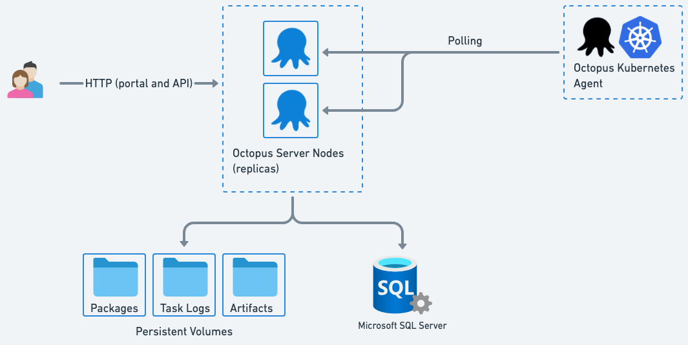

# Octopus Deploy Helm Chart

This chart installs [Octopus Deploy](https://octopus.com) into a Kubernetes cluster using the [Helm](https://helm.sh) package manager.

The published charts can be found in the [GitHub Container Registry repository](https://github.com/OctopusDeploy/helm-charts/pkgs/container/octopusdeploy-helm).


## Quick Start
This section shows you how to get Octopus running as quickly as possible on your own Kubernetes infrastructure. 

If you are creating a long-lived, production Octopus instance we recommend you read the [Configuration](#configuration) section below.

Once you have your [license key](#license-key), you can run the command below to install Octopus Deploy:

```
helm upgrade octopus-deploy \
--install \
--namespace octopus-deploy \
--create-namespace \
--set octopus.acceptEula="Y" \
--set octopus.licenseKeyBase64="<Your License Key>"
--set mssql.enabled="true" \
oci://ghcr.io/octopusdeploy/octopusdeploy-helm
```

### License Key
You will need a license key to install Octopus. You can [start a trial](https://octopus.com/start) (choose `Server` to run Octopus on your own infrastructure), or retrieve your existing license key from the [Control Center](https://octopus.com/control-center/). 

You will need the Base64 encoded version of the license key.


## Configuration

The Quick Start section above is optimized for simplicity.  Below we explain the optional configuration. 



### SQL Server
Octopus Deploy requires a Microsoft SQL Server database.

The Quick Start installs SQL Server as a sub-chart. 

If you want to host SQL Server independently, you must supply the connection string: 

```
octopus:
  databaseConnectionString: <Your connection string>
```

The database connection string should look something like:

```
Server=tcp:octopus-deploy.database.windows.net,1433;Initial Catalog=OctopusDeploy;Persist Security Info=False;User ID=octopus-deploy;Password={your_password};Encrypt=True;Connection Timeout=30;
```

See the Microsoft documentation for more [SQL Server installation options](https://learn.microsoft.com/en-us/sql/linux/sql-server-linux-setup).


### Master Key

[Octopus uses a master key to encrypt sensitive values](https://octopus.com/docs/security/data-encryption). 

**It is important you store the master key!**  
If you ever need to create a new Octopus instance and wish to use keep all your existing data, then the master key is required.  

By default, the master key is generated, stored in Kubernetes secret, and output when the Helm chart is installed.  If you need to supply an existing master key this can be done as follows 

```
octopus:
  masterKey: <Your master key>
```

### Persistent Volumes

This chart requires persistent volumes to store:

- [Packages](https://octopus.com/docs/packaging-applications/package-repositories/built-in-repository) 
- [Artifacts](https://octopus.com/docs/projects/deployment-process/artifacts)
- [Task Logs](https://octopus.com/docs/support/get-the-raw-output-from-a-task)

These volumes are shared across Octopus nodes. 

By default, your Kubernetes cluster's [default storage class](https://kubernetes.io/docs/tasks/administer-cluster/change-default-storage-class/) will be used.

This default can be overridden in two ways.

You can configure the storage class to be used for all three of the persistent volumes above (and for the SQL Server sub-chart if enabled) via:

```
global:
  storageClass: "<your storage class name>"
```

This storage class must support ReadWriteMany access modes when the chart is configured to create more than one Octopus node (`replicaCount` > 0). 
ReadWriteOnce or ReadWriteMany can be used for single node clusters.

Alternatively, each volume may be configured individually. An example is shown below.

```
octopus:
  packageRepositoryVolume:
    size: 20Gi 
    storageClassName: "azure-file"
    storageAccessMode: ReadWriteMany
  artifactVolume:
    size: 1Gi 
    storageClassName: "azure-file"
    storageAccessMode: ReadWriteMany
  taskLogVolume: 
    size: 1Gi 
    storageClassName: "azure-file"
    storageAccessMode: ReadWriteMany
```

### Ingress
You'll likely want to allow external traffic to your Octopus instance, and this generally means configuring [Ingress](https://kubernetes.io/docs/concepts/services-networking/ingress/). 

This requires an [ingress controller](https://kubernetes.io/docs/concepts/services-networking/ingress-controllers/) to be running in your cluster.

There are two types of traffic which you will typically want to configure ingress for:
- Web requests for the portal and HTTP API
- [Polling Tentacles](#polling-tentacles).  This will be required if you are using the [Octopus Kubernetes Agent](https://octopus.com/docs/infrastructure/deployment-targets/kubernetes/kubernetes-agent), or have virtual machines with Polling Tentacles installed. 

An example of a values file which configures ingress for HTTP traffic to the web portal and HTTP API using [NGINX](https://kubernetes.github.io/ingress-nginx/) is shown below:

```
octopus:
  ingress:
    enabled: true
    annotations: 
      kubernetes.io/ingress.class: nginx
    path: /
    hosts:
      - octopus.example.com 
```

#### <a name="polling-tentacles"></a>Polling Tentacles (including the Octopus Kubernetes Agent)

If you are deploying to Kubernetes using the [Octopus Kubernetes Agent](https://octopus.com/docs/infrastructure/deployment-targets/kubernetes/kubernetes-agent), or have Virtual Machines with an [Octopus Polling Tentacle](https://octopus.com/docs/infrastructure/deployment-targets/tentacle/tentacle-communication#polling-tentacles) installed, you will also need to configure ingress to allow Polling Tentacle traffic. 

If the chart is configured to create a single Octopus node (`replicaCount: 1`) then the polling tentacle port is exposed on the same service as the Octopus server.  If a replica count of greater than 1 is specified, then a kubernetes service will be created for each node.  

The following configuration will create an ingress endpoint for each Octopus node (replica). 


```
octopus:
  ingress:
    enabled: true
    hosts: 
      - octopus.example.com
    pollingTentacles:
          enabled: true
          annotations: {}
          labels: {}
          hostPrefix: "polling"
```

The resulting endpoints will be:
- polling0.octopus.example.com
- polling1.octopus.example.com
- etc, for each replica

Your Octopus Kubernetes Agents and Virtual Machine Polling Tentacles must be configured to poll every Octopus server node.  Documentation for configuring this can be found below:
- [Kubernetes Agent](https://octopus.com/docs/infrastructure/deployment-targets/kubernetes/kubernetes-agent/ha-cluster-support#octopus-deploy-ha-cluster) 
